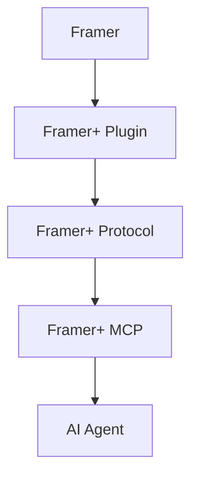
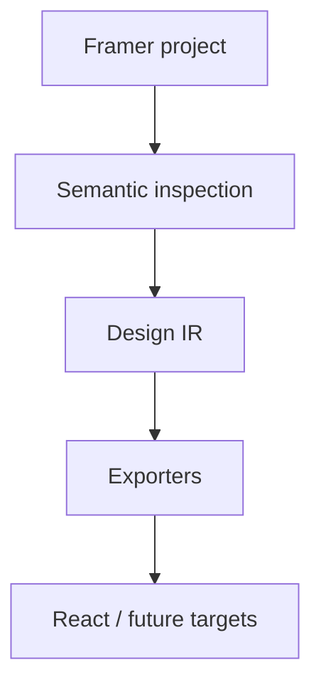

# Architecture

Framer+ primarily gives agents semantic access to the editor. Exporters consume the same inspection model.

The MCP process uses stdio for agent communication. A WSS server bound to 127.0.0.1 authenticates the plugin using a process-specific secret. Runtime-validated protocol version 4 carries named operations, bounded messages and session references. The plugin's EditorAdapter is the only layer that handles Framer SDK objects. Core and protocol represent serializable domain values.

Inspection reads are bounded. Mutation plans bind project, branch, session, revisions and exact operations, require native plugin approval, expire, serialize writes and stop on failure. They do not promise transactionality, replay or rollback.

`capture_design` traverses the active canvas, reads bounded nodes, rechecks revisions and project context, and stores a private snapshot. Capture is explicitly non-atomic. The design package transforms normalized snapshots into IR schema 1, preserving native identifiers, effective values, tokens, replica provenance and diagnostics. Role annotations are explicit; defaults are conservative. Repeated structural signatures are candidates, not automatic reusable-component extraction.

Generation consumes IR without Framer runtime objects. Primary mode emits the primary frame. Responsive mode requires explicit viewport ranges; frame widths do not prove media-query thresholds or inheritance. Known replica mappings produce CSS overrides, while structural/text mismatches are unsupported. Immediate primary-root sections become readable components. Text typography, rich content, unknown components, grids and positioning pins remain diagnostics rather than fabricated fidelity.

Artifacts contain project content and live in a local private directory. Image URLs remain HTTPS references and are not fetched or embedded. Regeneration compares baseline hashes with user files and new generated files. Compatible edits and unmanaged files survive; conflicts block output. Every successful regeneration uses a fresh directory; the old working tree stays intact. Source mappings connect node IDs to components/classes/files.

There is no hidden telemetry, remote automation adapter, browser HTML extraction or automatic publication. See RELEASE.md for stable acceptance gates.

## Multi-resource operations

Page discovery provides cross-page references. Some native non-active-page nodes are not resolvable until the page is opened; explicit open_page navigation verifies context and revokes old approvals/cursors. A reviewed plan groups up to ten distinct node or CMS targets, including explicit breakpoint replicas, instance controls and style links. Each preview shows its page/view context where applicable. All operations are validated before the first write, then applied in sequence with individual outcomes. CMS changes and card layout changes can share a plan; no implicit CMS-to-card mapping is invented. Create/move/delete remain implementation gaps.

The proposed authenticated outbound remote relay and optional Server API adapter are documented in [remote MCP feasibility](REMOTE_MCP.md). Neither is implemented in this alpha.

The alpha does not yet synchronize content between independent responsive structures or edit animation/effect settings. These require explicit correspondence, scope and API capability work; layout normalization alone does not implement them.
