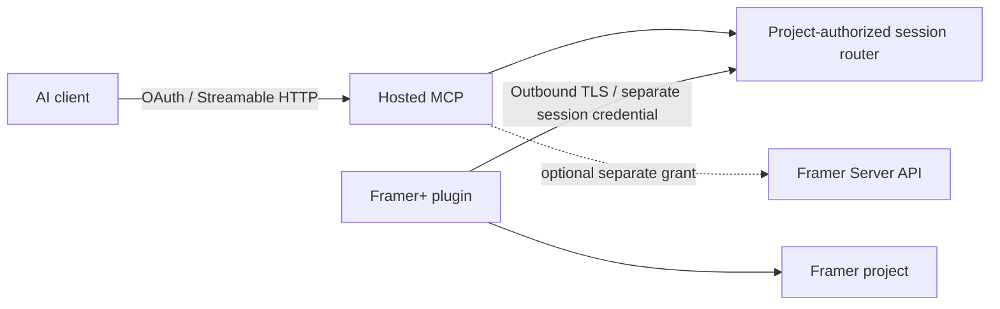

# Remote MCP feasibility and proposed trust model

Status: researched design, 2026-10-04. No hosted backend, remote listener, Server API adapter or remote transport proof-of-concept is implemented. Local loopback guarantees remain unchanged.

## Evidence and uncertainty

Framer documents plugins calling HTTPS services with `fetch`, including OAuth flows and a deployed HTTPS backend. This supports hosted HTTPS communication; it does not certify arbitrary hosted WebSocket endpoints in every plugin runtime. Local authenticated WSS was tested in a real editor. Hosted WSS/CSP, reconnect and network proxy behavior still need native acceptance. [Framer OAuth guide](https://www.framer.com/developers/oauth).

The Server API allows server-side project updates without opening the editor. Its SDK shares much of the Plugin API, but parity must be verified method by method. It adds publishing capabilities and is not transactional. Current Framer+ does not use it. [Introduction](https://www.framer.com/developers/server-api-introduction), [reference](https://www.framer.com/developers/server-api-reference), [FAQ](https://www.framer.com/developers/server-api-faq).

HTTP MCP requires its own authorization model. The proposed service uses Streamable HTTP with OAuth authorization, protected-resource metadata, PKCE and audience-bound tokens. Never forward MCP bearer tokens as plugin or Framer credentials. [MCP authorization](https://modelcontextprotocol.io/specification/2025-06-18/basic/authorization), [transports](https://modelcontextprotocol.io/specification/2025-06-18/basic/transports).

## Options

| Option | Feasibility | Decision |
| --- | --- | --- |
| A: agent → local MCP → local plugin | Implemented, authenticated loopback WSS and stdio | Keep supported as the default alpha flow. |
| B: agent → hosted MCP → plugin | HTTPS communication documented; outbound hosted WSS unverified | Viable candidate only after pairing/authentication and native networking acceptance. |
| C: remote MCP ← outbound plugin relay | Avoids exposing a local port; same networking uncertainty as B | Preferred proposed editor architecture. HTTPS polling fallback needs latency/ordering acceptance. |
| D: agent → MCP → Framer Server API | Official server-side access exists; requires a project API key and capability evaluation | Complement for headless workflows; does not replace editor selection or approval UI. |

B and C describe the same security boundary when the plugin initiates the connection. A public server must not dial a user's localhost, accept the current local pairing secret, or publish an editor control socket.

## Proposed lifecycle

1. The signed-in user opens Framer+ and requests a short-lived pairing challenge. An authenticated account session is required; a code alone cannot grant project access.
2. A browser account flow approves the displayed project, branch, requested read/write scopes and agent identity. Bind the challenge to a nonce, expiration, initiating plugin session and verified account. Treat plugin-reported project IDs as claims until authorization is established.
3. The router issues a separate short-lived editor-session credential, bound to account, project, plugin session and allowed origins. Keep it in plugin memory. Store renewable grants server-side encrypted; never store long-lived secrets in plugin browser storage.
4. The MCP client authorizes independently. Every tool request resolves to an explicitly selected authorized project/editor session; there is no global implicit active project. Multiple candidates require disambiguation.
5. Read grants allow bounded inspection. Write grants still require exact in-editor plan approval, fresh revision/context preflight, serial per-project execution and readback. Neither OAuth consent nor pairing automatically approves a design mutation.
6. Expiration, disconnect, logout or revocation disables routing, cancels pending reads, invalidates approvals and removes session credentials. An uncertain dispatched write remains uncertain; reconnection never replays it.

## Required controls before implementation

| Boundary | Required design |
| --- | --- |
| Authentication | OAuth 2.1-compatible MCP authorization, PKCE, issuer/audience checks, protected-resource metadata; separate plugin/account login and relay credential. |
| Project/user authorization | Account membership or verified ownership proof, project-scoped grants and read/write capabilities, branch identity, exact user approval. A client-supplied project ID is insufficient. |
| Pairing/replay | Single-use cryptographic nonce, short challenge TTL, server-side consumed state, session binding and rate-limited attempts. Request IDs plus consumed plan IDs; do not claim network replay prevention is a transaction. |
| TLS/origins | Public HTTPS/WSS with validated certificates; exact plugin origin allowlists and HTTP MCP Origin validation where present. Origin checks supplement credentials. Separate production/development allowlists. |
| Tokens/storage | Short access lifetime (proposed ≤15 minutes), pairing ≤5 minutes, rotating session grants; encrypt stored refresh grants and API keys with managed key access. No tokens in URLs/logs/archives. Browser flow cookies HttpOnly/Secure/SameSite with CSRF protection. |
| Revocation | Per-agent, per-project and per-plugin-session revocation; revoke all grants on account removal. Check authorization at dispatch and before writes; invalidate approvals on session/context changes. |
| Concurrency | Separate identity for each account/project/plugin/agent session. One project write queue across agents, fresh preflight after queue acquisition. No last-connected-wins routing. |
| Reconnect | New session negotiation and context verification; invalidate old references/approvals. Report requests dispatched before disconnect as uncertain, never automatically retry writes. |
| Limits | Preserve 64 KiB bridge messages and bounded traversal; service quotas for users/projects/agents, concurrent sessions, requests, CPU and queued writes. Reject excess with retry guidance for reads only. |
| Audit/privacy | Content-free operation identifiers/outcomes by default; no unpublished designs or CMS values in logs. Explicit retention policy, deletion/export controls, encrypted transport/storage, tenant isolation, restricted operator access. No persistent snapshots without opt-in. |
| Multiple agents | Display requesting agent and exact target changes at approval. Conflicting revisions fail; approvals are not transferable to another agent/session. |
| Operations | Monitor service availability without design content; documented incident response, credential rotation, abuse limits and independent security review. Fail closed on routing/auth failures. |

Hosted transport adds a service operator to the trust boundary. The operator can see plaintext editor data unless an independently reviewed end-to-end relay protocol is built; TLS alone does not remove that access. This privacy consequence needs explicit consent. CMS and unpublished designs must never become public endpoints or default shared caches.

## API responsibility matrix

| Capability | Plugin API | Server API proposal |
| --- | --- | --- |
| Active selection/canvas and editor approval UI | Required | Cannot replace editor UI context. |
| Pages, nodes, layout, responsive identities | Current adapter | Candidate shared methods; verify parity and permissions before enabling. |
| Components, styles, assets, CMS | Current bounded subset | Candidate shared methods; API-specific capability tests required. |
| Publishing/deployment | Not exposed by Framer+ | Official server additions; separate explicit publish grant/approval, outside this alpha. |
| Override provenance/reset | Not available in current adapter/public instance APIs | No evidence that Server API solves this; remain unavailable until proven. |
| Headless automation | Requires open plugin/editor | Server API is designed for this; project-key custody changes trust model. |

Framer documents project-specific API keys acting as their creator. They must stay on a trusted server or local secret store, never in an iframe bundle or agent-visible tool response. Access revocation, role changes and branch behavior require acceptance tests. [Server API quick start](https://www.framer.com/developers/server-api-quick-start).

## Decision and acceptance gates

A remote/hybrid MCP is reasonably feasible, but hosting the existing localhost bridge unchanged is unsafe. Implement a separate authenticated session service only after validating hosted networking, account/project authorization and operator privacy requirements. No experimental flag currently bypasses loopback restrictions.

The next authorized proof-of-concept should use a disposable project and a read-only relay: pair one user/project, enumerate pages, enforce origin/audience/expiry/revocation, reconnect without replay, reject cross-project requests and demonstrate payload/rate limits. Test WSS first and bounded HTTPS polling only if needed. Production requires multi-tenant isolation tests, an independent security review, operational ownership and client-specific remote MCP interoperability. Local MCP remains fully independent of this future service.
